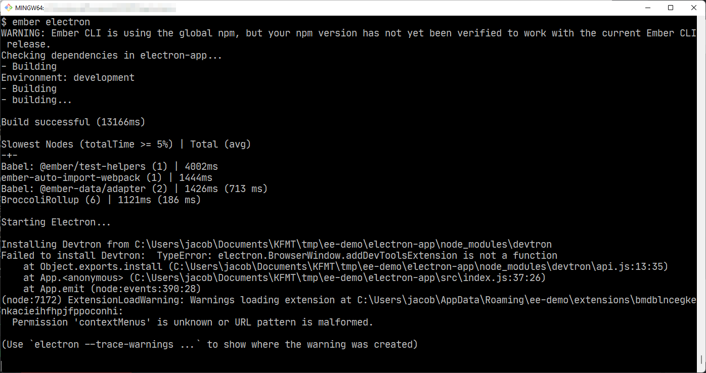

# Minimal example of using ember-electron

## Run

* `git clone <repo_url>`
* `cd <repo_name>`
* `npm install`
* `cd electron-app`
* `npm install`
* `electron-rebuild` (only needed if you have native modules)
* `cd ..`
* `ember electron`

